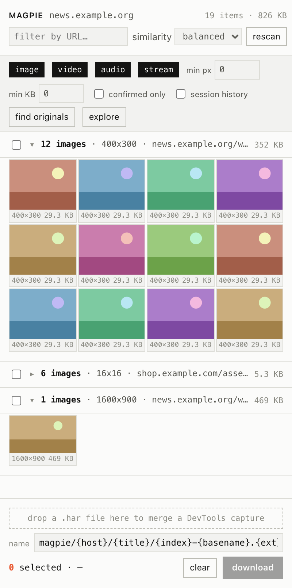

# Magpie

A universal media harvester for the browser: it finds every image, video and
audio file a page loads or references, groups them by similarity, and downloads
them in bulk.



*The panel at its real 400px width: one page, three clusters - a 12-image
gallery, a collapsed set of 6 UI icons, and a hero on its own. Tiles in these
captures are flat placeholders (the fixture URLs point at hosts that do not
exist); the layout, metadata, clustering and selection state are real.
Regenerate with `npm run screenshots`.*

It exists because every other downloader either scrapes the DOM (fragile, misses
everything a single-page app fetches) or watches the network (catches
everything, including garbage, with no relationship to what is on screen).
Magpie does both and joins them. The signature interaction is **similarity
selection**: right-click one image and it selects every other item on the page
that belongs to the same set - same DOM structure, same URL shape, same
dimensions - and downloads them together.

The same mechanic at scale, as a full-length capture rather than an inline
image because it is 400 x 2873: [122 assets recognised as one set, 40 selected,
9.3 MB queued](docs/panel-bulk.png).

**Four detection layers feed one per-tab index, deduplicated by normalized URL:**
a `chrome.webRequest` observer (listener mode only); a MAIN-world interceptor at
`document_start` that mines `fetch`/XHR JSON payloads for media URLs an SPA has
not rendered yet; a DOM scanner covering `srcset`, `picture`, lazy `data-*`
attributes, CSS `background-image`, inline `<svg>`, `<canvas>` and gallery
`<a href>` links; and HAR import for a DevTools capture - which, when the
capture was exported *with content*, saves the files straight out of the archive
without touching the network. An item seen by both the DOM and the network is
`confirmed` and sorts first.

**Similarity** is `0.35·url + 0.25·structure + 0.20·dimensions + 0.10·type +
0.10·host`, cut at `loose 0.45 / balanced 0.62 / strict 0.80`, clustered with
single linkage. The structure term has three states: a score, `0` when two items
are known to sit in *different* repeated groups (a carousel is not the grid
below it), and a neutral `0.5` when either item has no DOM at all - absence of
evidence must not be counted as evidence of difference.

---

## Install (unpacked)

No build step, no bundler, no `npm install`. The folder you cloned *is* the
extension.

1. Open `chrome://extensions`
2. Turn on **Developer mode**
3. **Load unpacked** → choose this folder
4. Pin it. Clicking the icon opens the side panel for the current tab.

Chrome 120+. Loads unchanged in Arc, Dia, Brave and Edge; without
`chrome.sidePanel` the panel opens in a popup window instead.

```sh
npm test           # 116 unit tests, the service-worker smoke test, then the end-to-end run
npm run test:unit  # unit tests only, no browser needed
npm run test:e2e   # the extension against a local gallery in a real Chrome (38 assertions)
npm run test:dash  # DRM boundary checked in the real panel (18 assertions)
npm run gallery    # serve that gallery on :8765 to try the extension by hand
npm run screenshots
```

`package.json` declares no dependencies. The browser checks look for a Chromium
(`CHROME_PATH` points at one) and skip with a notice if none is found - except
under `CI`, where they fail instead of skipping, because skipping is how a dead
service worker goes unnoticed. CI installs **Chrome for Testing** on purpose:
branded Google Chrome 137 and later ignores `--load-extension` without a word,
and the workflow refuses to continue on a branded build.

The end-to-end run serves a gallery from the test process - thumbnails linking
to originals, a hero, a toolbar of icons, a lazy section, an iframe that
arrives late, a painted canvas and an inline `data:` image - loads the unpacked
extension in Chrome, and reads the result back out of the real panel: what was
indexed and by which layers, how it clustered, that "find originals" proved the
full-size files with `HEAD` alone, and that the download wrote every original's
exact bytes under the templated name. It also loads nothing from outside the
machine.

---

## Permissions

| Permission | Why |
|---|---|
| `webRequest` | Layer A, **listener mode only** - never blocks, redirects or rewrites. Hence no `webRequestBlocking`, no `declarativeNetRequest`. |
| `downloads` | The point. Every download starts from an explicit click. |
| `storage` | Per-tab index in `chrome.storage.session` (an MV3 worker restart loses nothing), options in `chrome.storage.local`. Nothing leaves the machine. |
| `contextMenus` | The right-click entry points, including two-click "download all similar". |
| `notifications` | Reports what a context-menu download queued, since that path never opens the panel. |
| `sidePanel` | The panel. |
| `<all_urls>` | It has to work on any site: observe requests, run the scanner, `HEAD`-check upgrades, fetch what you selected. |

Deliberately **not** requested: `tabs`, `cookies` (a session-gated stream gets
`yt-dlp --cookies-from-browser` rather than your cookie jar), `history`,
`bookmarks`, `webNavigation`, `management`, `debugger`.

---

## Resolution upgrades

Thumbnails are a trap: a naive downloader saves the 150 px copy. Magpie derives
candidate full-size URLs and **proves each with a `HEAD` request** before
offering it. A candidate that fails, returns a non-media type, or reports a
*smaller* `Content-Length` is discarded and the original kept. Once upgrades are
known, items that would fetch the same bytes are collapsed, so a thumbnail and
its own full-size original never download twice.

Generic rules cover WordPress `-300x200` suffixes, `_thumb`/`_small` stems,
`/thumbs/` → `/original/`, resize/quality/format query parameters,
Cloudinary-style transform segments, `=s220` suffixes and Wikimedia `/thumb/`.

### `rules/site-rules.json`

Per-host overrides are data, not code.

| Field | Required | Meaning |
|---|---|---|
| `match` | yes | Hostname or suffix. `example.com` matches `cdn.example.com`, not `notexample.com`. `*` matches any host. |
| `find` | yes | Regex applied to the whole URL. |
| `replace` | yes | Replacement; `$1`…`$9` are capture groups. |
| `path` | no | Regex the pathname must satisfy first. |
| `verify` | no | `false` skips the `HEAD` check. Defaults true. |
| `note` | no | Shown in the panel beside the upgraded URL. |

```json
{
  "match": "redd.it",
  "find": "^https?://preview\\.redd\\.it/([^?]+).*$",
  "replace": "https://i.redd.it/$1",
  "note": "Reddit: preview.redd.it renditions have an i.redd.it original"
}
```

`https://preview.redd.it/abc123.jpg?width=320&crop=smart` →
`https://i.redd.it/abc123.jpg`, then `HEAD`-checked. Rules run in array order
before the generic ones; a malformed regex is skipped, not fatal.

---

## Streams

HLS and DASH manifests are parsed in-process (no dependencies) and their
variants listed with resolution, bitrate, codec and estimated size. You then get
a **`yt-dlp` command**, an **`ffmpeg` command** (`-c copy`, with headers), or a
**segment list** as JSON. Magpie does not ship `ffmpeg.wasm` and does not remux
video in a browser tab; a correct shell command is more useful and considerably
more honest.

---

## Explore

`explore` walks the app on its own: it scrolls each page to the bottom in steps
so lazy loaders and infinite feeds fire, clicks the controls that reveal more
media, follows same-origin links, and keeps one index across the whole walk. It
is how you get at photos that only exist after a "load more", a lightbox, or a
second page.

Scrolling and following links are GET-shaped and reversible, so they are
exhaustive. **Clicking is not**, and it is governed differently: on an app where
you are signed in, an indiscriminate clicker eventually hits "Delete", "Pay" or
"Log out". A click therefore needs a positive reason - the control either wraps
media or reads as a media control - and everything else is refused. Form
controls, anything inside a `<form>`, submit buttons, `download` attributes,
`target="_blank"` and any label or class matching the transactional/destructive
list are refused whatever else they look like. A link is never clicked; it is
queued for navigation, where the same list is applied to the path, because
`/logout` is a GET on most sites.

Bounded by construction: 40 pages, 60 clicks and 40 scroll steps per page, a
1.2 s gap between navigations, and a stop that reaches both the queue and the
page. The rules live in `src/core/explore-policy.js` and are tested against a
set of traps.

## DRM - a hard boundary

**Magpie never circumvents DRM and contains no code path that could.**

When a stream declares encryption - `#EXT-X-KEY` with any method other than
`METHOD=NONE`, or a DASH `ContentProtection` element - or when the page calls
`navigator.requestMediaKeySystemAccess`, the affected media is marked
`protected`: dimmed, badged `DRM`, its download control disabled, all three
stream actions withheld, and the download queue refuses it even if it is
selected some other way. Key systems are identified only to say "not
downloadable": no key material is requested, stored or parsed, no `pssh` box or
`default_KID` leaves the parser, and no segment is ever decrypted.

This is a design boundary, not a setting. Please do not send patches that cross
it.

---

## What this does not do

- **No DRM circumvention.** See above.
- **No video remuxing.** Streams give you a command and a segment list, not an `.mp4`.
- **No live-stream recording.** A live playlist is reported as live; capturing it is `yt-dlp`'s job.
- **Nothing the browser itself cannot fetch.** A cross-origin tainted `<canvas>` is marked `unavailable`.
- **No auto-download, ever.** Nothing is fetched without a click.
- **No telemetry, no analytics, no remote calls.** Beyond fetching what you asked for and `HEAD`-checking upgrades, it makes no network requests. No CDN, no web fonts.
- **No account, login or sync.** The index lives in session storage and dies with the tab.
- **Clustering is capped** at 1200 items per view (the score matrix is quadratic). The remainder is listed ungrouped and the panel says so rather than hiding it.
- **A hero image with the same dimensions as the grid below it will cluster with that grid.** Magpie detects that the two sit in different repeated structures and zeroes the structural term - but the remaining four terms floor at 0.4625 for two images sharing a host, a directory and a file type, so the dimension term alone carries the rest of the way to 0.62. At identical dimensions the pair scores 0.6625 and merges. That is a limit of the current term weights, not of the repeated-group test; `strict` separates them.
- **The explorer's safety rules are lexical, and only English and Italian.** An icon-only control labelled in a third language is not clicked - it fails closed, so you lose media rather than trigger something. Widen `RISK_WORDS` / `OPPORTUNITY_WORDS` in `src/core/explore-policy.js` for another locale.
- **The explorer has no rate-limit backoff.** The download queue honours 429 and `Retry-After`; the crawl only has a fixed 1.2 s gap between pages. On a site that throttles hard, slow it down or stop it.
- **The explorer drives the tab you are looking at**, one page at a time, and cannot resume a crawl in a tab you have closed.
- **It cannot see inside cross-origin iframes it is not injected into**, and no extension runs on `chrome://` pages or the Chrome Web Store.

## Not verified

Stated plainly rather than implied by silence:

- **Arc, Dia, Brave and Edge have not been launched.** Nothing Chrome-only is used beyond `chrome.sidePanel`, which has a popup fallback, but that is an argument, not a test.
- **The panel has been driven by a script, not by a person.** The end-to-end run selects a group, presses download, reads the progress line and checks the files; nobody has used it interactively for a long session, so keyboard flow, scroll behaviour under load and hover states are unproven in practice.
- **HAR import is tested against a synthetic HAR** - built from real image files, and proven to save them with the web server stopped, but not against an archive exported by DevTools itself.
- **The explorer has only met a fixture app.** Two pages, four deliberate traps, everything on localhost. It has never walked a real third-party site, where the shapes are messier and the throttling is real.
- **No commercial DRM player has been visited.** The DRM path is verified with hand-written HLS and DASH manifests, a simulated `requestMediaKeySystemAccess` call, and assertions read out of the real panel - not against Netflix or Spotify.
- **No DASH manifest has been fetched from a live CDN.** HLS has (Apple's public test stream, downloaded for real with the generated command).
- **The 122-item bulk download was measured once**, on localhost. Behaviour against a rate-limiting CDN rests on the retry/backoff code, which has not met a real 429.
- **The context menu has not been driven mechanically.** Its two-click path shares the download queue and the similarity engine with the panel, both of which the end-to-end run exercises, but no test right-clicks an image.

---

## Keyboard

| Key | Action |
|---|---|
| `/` | focus search |
| `a` | select/deselect every item in the focused group |
| `Enter` | download the selection |
| `Escape` | close the drawer, or clear the selection |
| `Space` | toggle the focused item |
| `i` | open the detail drawer |

---

## Your responsibility

Magpie collects media you are allowed to collect. Respecting the terms of
service of the sites you point it at, and the copyright of what you download, is
on you. Being able to fetch something is not the same as being entitled to keep,
republish or redistribute it.

MIT licensed - see [LICENSE](LICENSE).
